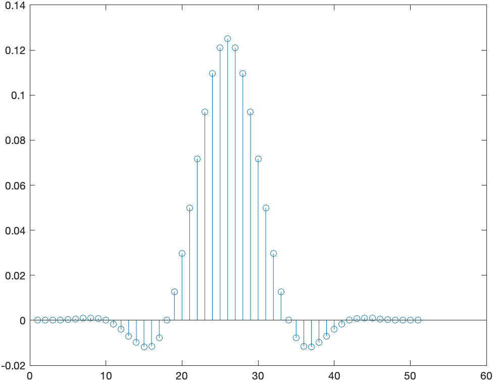
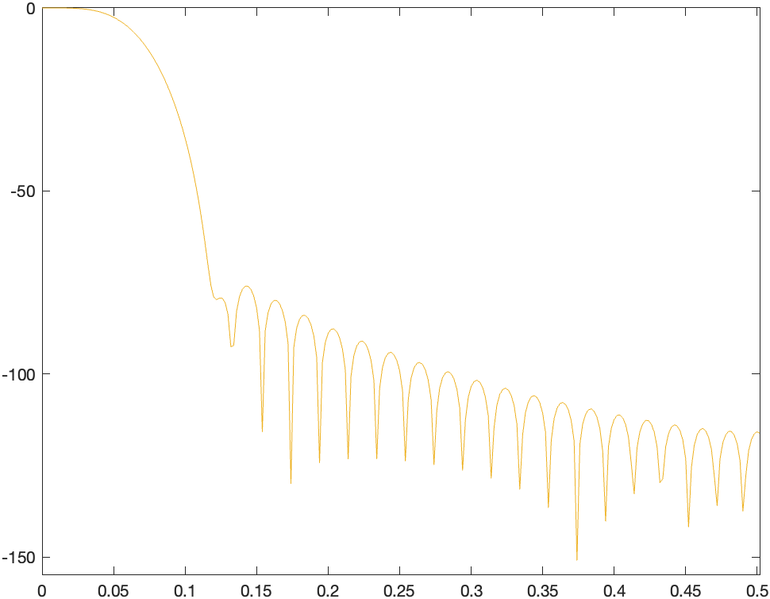

# FilterDesign
This project is about designing a low pass filter in MATLAB, to be later implemented on the Adruino Due platform.
The goal was to get used to MATLAB, designing methods, and the Fourier Transform computation.

Here is an example of the plots generated by the code. This is a low pass filter in time and frequency domain.

  
  &nbsp; &nbsp; &nbsp;
  

## How does it work ?
Launch the file [FilterDesign](FilterDesign.m) with MATLAB_R2021b.

Running the code will not display anything. 
The plots are written in code comment. Read the file and remove the '%' before the line you want to display. 
Hit the "Run" button.

## MATLAB
This project was done using MATLAB_R2021b.

## Collaborators
I worked on this project with one classmate.

## License
[MIT License](LICENSE)
